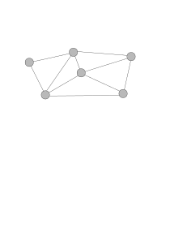

# The Constrained Bottleneck Spanning Tree Problem with Upgrades (CBSTU)

🚧 Under construction 🚧

Existing algorithms that solve the Constrained Bottleneck Spanning Tree Problem (CBST) are implemented and converted to solve the CBSTU:
- [The Constrained Bottleneck problem in Networks](https://www-jstor-org.kuleuven.e-bronnen.be/stable/171309#metadata_info_tab_contents) Berman et al. 
- [An Improved Algorithm for the Constrained Bottleneck Spanning Tree Problem](https://pubsonline-informs-org.kuleuven.e-bronnen.be/doi/abs/10.1287/ijoc.8.1.41) by Punnen & Nair

Problem tailored Edge Elimination algorithm provides fastest performance. Calculating lower and upperbound beforehand is the bottleneck in the Punnen algorithm, so we avoid calculating bounds beforehand and use a binary search combined with updating the working graph (eliminating edges) to increase performance.

  

